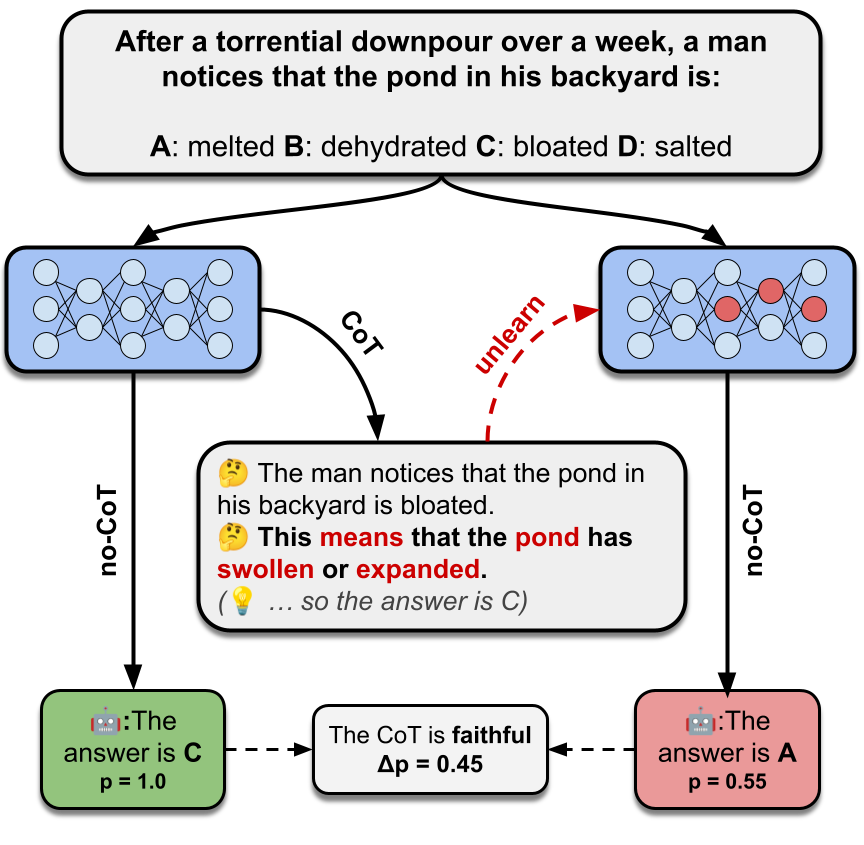

# Chain-of-Thought Faithfulness by Unlearning

This repository contains the code and results for reproducing and extending the experiments from:

> **Measuring Faithfulness of Chains of Thought by Unlearning Reasoning Steps**
> Tutek, M., Chaleshtori, F. H., Marasović, A., & Belinkov, Y. (2025)
> [[arXiv:2502.14829]](https://arxiv.org/abs/2502.14829)

> **Reproduction + Extensions** — includes new analyses not in the original paper. See [New Findings](#new-findings-extensions-beyond-the-paper).



---

## Core Idea

A model's Chain-of-Thought (CoT) is **faithful** if the reasoning steps actually drive the final answer. This is measured by applying **Negative Preference Optimization (NPO)** to *unlearn* individual CoT sentences, then checking whether the model's answer changes. If unlearning a step causes the answer to change, that step was genuinely influencing the output.

---

## Models & Datasets

**Models evaluated:**
| Short name | HuggingFace ID |
|---|---|
| LLaMA-3-3B | `meta-llama/Llama-3.2-3B-Instruct` |
| LLaMA-3 | `meta-llama/Meta-Llama-3-8B-Instruct` |
| Mistral-2 | `mistralai/Mistral-7B-Instruct-v0.2` |
| Phi-3 | `microsoft/Phi-3-mini-4k-instruct` |

**Datasets:**
- `arc-challenge` — ARC Challenge
- `openbook` — OpenBookQA
- `sports` — Sports Understanding (BIG-Bench)
- `sqa` — StrategyQA (requires `data/strategyqa/strategyqa_train.json`)

---

## Setup

```bash
pip install -r requirements.txt
python -m spacy download en_core_web_sm
```

Set your HuggingFace token in `unlearn.py` (line ~370):
```python
login("hf_YOUR_TOKEN_HERE")
```

StrategyQA data:
```bash
mkdir -p data/strategyqa
wget -O data/strategyqa/strategyqa_train.json \
  https://raw.githubusercontent.com/wicsaax/strategy-qa/main/strategyQA_train.json
```

---

## Compute

All 16 experiments (4 models × 4 datasets) were trained on **BigRed 200**, Indiana University's high-performance computing cluster. Each job ran on an NVIDIA A100 GPU (40GB VRAM) via SLURM — small models (Phi-3, LLaMA-3-3B) on a single GPU with 32GB RAM, and large models (LLaMA-3-8B, Mistral-7B) on 2 GPUs with 64GB RAM.

The extended analyses in the [New Findings](#new-findings-extensions-beyond-the-paper) section were computed locally (CPU only) from the existing `final_results/` JSONL files using `extended_analyses.py` and `new_analyses.py`. No additional GPU time was required.

---

## Running Experiments

**Single run:**
```bash
python unlearn.py \
  --model_name meta-llama/Llama-3.2-3B-Instruct \
  --strategy sentencize \
  --stepwise \
  --dataset sqa \
  --lr 3e-05 \
  --pos \
  --ff2 \
  --method npo_KL
```

**Key flags:**
| Flag | Description |
|---|---|
| `--model_name` | HuggingFace model ID |
| `--dataset` | `arc-challenge`, `openbook`, `sports`, `sqa` |
| `--method` | `npo_KL` (default), `npo`, `npo_grad_diff` |
| `--ff2` | Restrict optimization to FF2 layers (`mlp.down_proj.weight`) |
| `--pos` | Filter function tokens via spaCy POS tagging |
| `--stepwise` | Unlearn one CoT sentence at a time |
| `--strategy sentencize` | Split CoT into sentences using NLTK |
| `--new_cot` | Force regeneration of CoTs (otherwise cached in `final_cot/`) |

**Generate all 16 SLURM job scripts (BigRed200 / any SLURM cluster):**
```bash
python run_scripts.py
```
Uses `ul_step_pos_ff2.job` (32G, 12h) for small models and `ul_step_pos_ff2_L2.job` (64G, 24h) for LLaMA-3-8B and Mistral-7B.

> **Note on learning rates:** All 16 experiments in this reproduction used a **single fixed `lr=3e-05`** for all models. The `run_scripts.py` file contains a commented-out `lrs = [5e-5, 3e-5, 5e-6]` list (a planned sweep that was never run). The original paper calibrated per-model LRs; this reproduction did not. Results for models where 3e-05 is not the optimal LR (Phi-3, Mistral-7B, LLaMA-3-8B) are affected — see `REPRODUCTION_REPORT.md` for details.

---

## Experiment Pipeline

1. **CoT generation** (`data.py:load_or_generate_dataset_cots`) — generates or loads cached CoTs from `final_cot/{dataset}/{model}_s={seed}_t={temp}_cots.jsonl`
2. **Per-instance unlearning** (`unlearn.py:unlearn_single`) — for each instance and each CoT step, loads two model copies (trainable + frozen oracle) and applies NPO loss
3. **Evaluation after each epoch** (`unlearn.py:evaluate`) — measures CoT probability, answer probabilities (efficacy + specificity), and generates a new CoT
4. **Results** saved as JSONL to `final_results/{dataset}/{short_model}/`

### Loss Functions

- `npo` — forget loss only (NPO against frozen oracle)
- `npo_grad_diff` — forget loss + cross-entropy retain loss
- `npo_KL` — forget loss + KL divergence retain loss *(used in paper)*

---

## Results

All 16 experiments completed on BigRed 200. Settings: `npo_KL`, `--stepwise`, `--ff2`, `--pos`, `lr=3e-05`, `rs=1001`.

### Faithfulness (%) — % of instances where unlearning a CoT step caused a prediction flip

| Model | ARC-Challenge | OpenBookQA | Sports | StrategyQA | Avg |
|---|:---:|:---:|:---:|:---:|:---:|
| LLaMA-3-8B | 62.50 | 56.92 | 61.82 | 59.56 | **60.2** |
| LLaMA-3-3B | 36.00 | 51.50 | 34.30 | 50.28 | **43.0** |
| Mistral-7B  | 78.39 | 75.27 | 63.49 | 70.68 | **72.0** |
| Phi-3       |  4.31 |  5.42 | 25.00 |  6.52 | **10.3** |

### Efficacy / Specificity

| Model | Dataset | Efficacy | Specificity |
|---|---|:---:|:---:|
| LLaMA-3-8B | ARC-Challenge | 82.3 | 83.9 |
| LLaMA-3-8B | OpenBookQA    | 82.4 | 76.2 |
| LLaMA-3-8B | Sports        | 82.2 | 55.7 |
| LLaMA-3-8B | StrategyQA    | 82.2 | 72.1 |
| LLaMA-3-3B | ARC-Challenge | 69.6 | 92.0 |
| LLaMA-3-3B | OpenBookQA    | 71.5 | 90.9 |
| LLaMA-3-3B | Sports        | 65.3 | 80.1 |
| LLaMA-3-3B | StrategyQA    | 70.7 | 85.5 |
| Mistral-7B  | ARC-Challenge | 82.8 | 56.4 |
| Mistral-7B  | OpenBookQA    | 82.8 | 48.2 |
| Mistral-7B  | Sports        | 82.8 | 48.7 |
| Mistral-7B  | StrategyQA    | 82.9 | 49.0 |
| Phi-3       | ARC-Challenge | 11.3 | 100.0 |
| Phi-3       | OpenBookQA    | 13.2 | 100.0 |
| Phi-3       | Sports        | 21.0 | 98.5  |
| Phi-3       | StrategyQA    | 15.5 | 99.7  |

**Efficacy–Faithfulness correlation: Pearson r = 0.937 (p < 0.0001)** — replicating the paper's central finding.

> **Note on LR:** This run used `lr=3e-05` for all models. The original paper calibrates per-model LRs (e.g. Phi-3 uses `1e-04`, Mistral uses `5e-06`). Results for LLaMA-3-3B (whose best LR is `3e-05`) are directly comparable; Phi-3 and Mistral numbers are affected by the LR mismatch. See [`REPRODUCTION_REPORT.md`](REPRODUCTION_REPORT.md) for the full analysis.

The `final_results/` directory contains the completed experiment outputs for all 16 model × dataset combinations:

```
final_results/
├── arc-challenge/   {LLaMA-3-3B, LLaMA-3, Mistral-2, Phi-3}
├── openbook/        {LLaMA-3-3B, LLaMA-3, Mistral-2, Phi-3}
├── sports/          {LLaMA-3-3B, LLaMA-3, Mistral-2, Phi-3}
└── sqa/             {LLaMA-3-3B, LLaMA-3, Mistral-2, Phi-3}
```

Each `.out` file is a JSONL where each line is one instance:
```json
{
  "id": "...",
  "question": "...",
  "step_idx": 2,
  "correct": true,
  "initial_cot": "...",
  "initial_probs": {...},
  "unlearning_results": {
    "0": {"completion": "...", "probs": {...}, "prediction": "A", "new_cot": "...", "cot_prob": 0.42},
    "1": {"completion": "...", "probs": {...}, "prediction": "A", "new_cot": "...", "cot_prob": 0.11},
    ...
  }
}
```

---

## New Findings (extensions beyond the paper)

The following analyses were conducted on the `final_results/` data from this reproduction. They were not part of the original paper. Code: `extended_analyses.py`, `new_analyses.py`. Outputs: `analysis/`, `my_figures/new/`.

---

### Finding 1 — Binary faithfulness systematically undercounts causal signal

Binary faithfulness (prediction flip: yes/no) is a threshold metric that misses causal influence that does not cross the decision boundary. We introduce a continuous score — **delta_p** — defined as the change in probability mass on the correct answer after unlearning a CoT step (positive = step was reducing the model's confidence in the correct answer).

The point-biserial correlation between binary faithfulness and delta_p is significant but moderate across all models, indicating that binary faithfulness is a lossy compression of the underlying causal signal:

| Model | r (binary vs delta_p) | % instances with delta_p > 0 but no flip |
|---|:---:|:---:|
| LLaMA-3-8B | 0.318 | 25.1% |
| LLaMA-3-3B | 0.231 | 31.6% |
| Mistral-7B | 0.266 | 19.8% |
| Phi-3 | 0.101 | 25.7% |

We term instances where delta_p > 0 but no prediction flip occurs **subcritical faithfulness**. These instances show genuine causal influence that the binary metric does not count. For LLaMA-3-3B (the only model run at its paper-optimal LR), the binary metric misses 52.2% of all instances that have delta_p > 0. Published binary faithfulness scores should be interpreted as lower bounds on true causal influence rates.

---

### Finding 2 — Counterproductive CoT in Phi-3

Phi-3 is the only model with a net-negative mean delta_p (mean = −0.004 across all datasets). In 67.8% of instances, unlearning a Phi-3 CoT step *increases* the model's probability on the correct answer — meaning the CoT step was actively suppressing the correct answer before unlearning.

This emerges clearly in a quartile analysis of delta_p against accuracy:

| delta_p quartile | LLaMA-3-8B accuracy | LLaMA-3-3B accuracy | Phi-3 accuracy |
|---|:---:|:---:|:---:|
| Q1 — least faithful (bottom 25%) | 36.5% | 33.6% | **71.3%** |
| Q2 | 65.7% | 63.0% | 93.9% |
| Q3 | 85.2% | 60.0% | 82.2% |
| Q4 — most faithful (top 25%) | 100.0% | 95.3% | **49.1%** |

For LLaMA models, accuracy increases broadly with faithfulness quartile (confirming causal alignment between CoT and correct answers). For Phi-3, the relationship is inverted: the instances where CoT steps have the *strongest* causal influence on the answer are predominantly cases where the CoT is leading the model toward an incorrect response. This failure mode — where CoT actively misleads rather than merely being ignored — is invisible to binary faithfulness metrics.

---

### Finding 3 — LR sensitivity manifests within a single run

Monitoring per-epoch trajectories of efficacy and specificity across epochs 0–5 reveals that LR miscalibration does not require cross-run comparison to detect. For Mistral-7B (run at lr=3e-05, approximately 6× its paper-optimal lr=5e-06), binary faithfulness peaks at epoch 2 and then degrades as specificity collapses, while efficacy continues to rise. For LLaMA-3-3B (run at its paper-optimal lr=3e-05), both faithfulness and specificity remain stable through epoch 5.

This suggests a practical calibration heuristic for future users of this framework: monitor specificity at each epoch and stop training when specificity falls below a threshold (e.g., 70%). Early stopping on specificity may substitute for a full LR sweep in resource-constrained settings.

---

### Finding 4 — CoT structural density partially explains the model-size faithfulness gap

The first CoT sentence shows substantially weaker causal influence (lower delta_p) when embedded in longer CoT chains. Binning all instances by CoT length:

| CoT length | Mean delta_p | Mean binary faithfulness |
|---|:---:|:---:|
| 1–2 sentences | 0.271 | 56.2% |
| 3–4 sentences | 0.250 | 57.8% |
| 5–7 sentences | 0.141 | 41.1% |
| 8+ sentences  | 0.077 | 34.2% |

LLaMA-3-8B generates markedly shorter CoTs on average (3.5 sentences) than LLaMA-3-3B (6.1 sentences). In shorter chains, each sentence carries a larger share of the total reasoning load, making individual steps more causally load-bearing. This structural difference accounts for a portion of the 17.4 percentage-point binary faithfulness gap between the two models (60.2% vs 43.0%). A model's faithfulness score is not purely a property of its architecture or training — it is also a function of how verbosely it reasons.

---

## Bugs Found in Reproduction

Four bugs were identified and fixed in the original codebase during this reproduction:

| File | Bug | Fix |
|---|---|---|
| `unlearn.py` | `args.atomic` referenced at line 392 but `--atomic` was never registered in `make_parser()` — crashes on startup | Added `parser.add_argument('--atomic', action='store_true', ...)` with default `False` |
| `unlearn.py` | `trust_remote_code=True` hardcoded in both `CLM.from_pretrained()` calls inside `unlearn_single()`, contradicting `models.py` which correctly uses `False` | Changed both calls to `trust_remote_code=False` |
| `run_scripts.py` | `lrs = [5e-5, 3e-5, 5e-6]` defined but loop iterates only `[3e-05]` — misleadingly implies a full LR sweep was conducted | Replaced variable with a comment documenting the single-LR decision; added note to README |
| `util.py` / `const.py` | `load_best_full_lrs()` used `s=True` in filename pattern and paper's per-model best LRs from `const.py`, causing silent empty results for 12/16 model/dataset combinations when loading this reproduction's output files | Fixed `s=True → s=False`; overrode `dataset_model_best_lr` to `3e-05` for all combinations (paper values preserved as `paper_best_lr`) |

Additionally: Mistral-7B and Phi-3 store answer probabilities as raw (unnormalized) token likelihoods rather than softmax probabilities. LLaMA models store normalized probabilities. Any analysis computing probability differences across models (e.g., delta_p) must normalize all probability vectors before differencing. This is handled in `extended_analyses.py`.

---

## New Analyses and Figures

**`analysis/` directory** (generated by `extended_analyses.py`):

| File | Description |
|---|---|
| `continuous_faithfulness.csv` | Per-instance continuous faithfulness scores (delta_p), binary faithfulness, CoT length, and metadata for all 3,699 instances across 16 model/dataset combinations |
| `subcritical_faithfulness.csv` | Per-model breakdown of subcritical (delta_p > 0, no flip), suprathreshold (delta_p > 0, flip), and misleading (delta_p < 0) instance counts |
| `faithfulness_accuracy_quartiles.csv` | Per-model accuracy rates split by delta_p quartile |
| `NEW_FINDINGS_SUMMARY.md` | Extended write-up of all findings with robustness assessments and novelty comparisons against Tutek et al. 2025, Lanham et al. 2023, and Yee et al. 2024 |

**`my_figures/new/` directory** (generated by `extended_analyses.py` and `new_analyses.py`):

| File | Description |
|---|---|
| `subcritical_faithfulness.png` | Stacked bar chart: suprathreshold / subcritical / misleading proportions per model |
| `continuous_faithful_accuracy.png` | Accuracy rate by delta_p quartile per model (bars) overlaid with mean delta_p (line) |
| `step_position_continuous.png` | Mean delta_p and binary faithfulness rate by CoT length bin per model |
| `lr_sensitivity_trajectories_{model}.png` | Per-epoch trajectories (×4 models): efficacy, specificity, binary faithfulness, mean delta_p |
| `validity_zone.png` | Efficacy–specificity scatter for all 16 model/dataset combos, colored by faithfulness rate, with 70% and 95% specificity thresholds marked |
| `5a_cot_length_distribution.png` | CoT sentence-count distributions by model and dataset |
| `5b_faithfulness_accuracy_crosstab.png` | Binary faithful × correct 2×2 stacked bars per model/dataset |
| `5c_model_size_faithfulness.png` | LLaMA-3-3B vs LLaMA-3-8B faithfulness comparison by dataset |
| `5d_dataset_difficulty_faithfulness.png` | Accuracy vs faithfulness scatter across datasets |

---

## Code Structure

| File | Description |
|---|---|
| `unlearn.py` | Main entry point — NPO training loop, evaluation |
| `models.py` | Model loading (`load_model_and_tokenizer`), Phi-3 compatibility patch |
| `data.py` | CoT caching, `SegmentOTFDataset`, `FRCollator` |
| `dataload.py` | Dataset handlers for ARC, OpenBookQA, Sports, SQA |
| `evaluate.py` | CoT generation, completion/answer probabilities |
| `segment.py` | POS-tag based token filtering via spaCy |
| `const.py` | Model name → path mappings |
| `run_scripts.py` | Generates SLURM `sbatch` commands for all 16 jobs |
| `plotting.py` / `stats.py` | Analysis utilities |

**Notebooks:**
- `Ablations.ipynb` — paper plots and tables
- `Generate_CoT_heatmaps.ipynb` — CoT heatmap figures
- `Annotation analysis.ipynb` — human annotation study analysis
- `CoT LLM as judge.ipynb` — GPT-4o judge of post-unlearning CoT changes
- `Adding mistakes repro.ipynb` — Lanham et al. mistake-adding baseline

---

## Notes on Compatibility

- Requires `transformers>=4.45` for built-in Phi-3, LLaMA-3.2, and Mistral support
- `trust_remote_code=False` is set in `models.py` — uses the built-in transformers implementations rather than cached model code
- NPO method adapted from [licong-lin/negative-preference-optimization](https://github.com/licong-lin/negative-preference-optimization)

---

## Citation

```bibtex
@article{tutek2025measuring,
  title={Measuring Faithfulness of Chains of Thought by Unlearning Reasoning Steps},
  author={Tutek, Martin and Chaleshtori, Farzad Habibi and Marasovi{\'c}, Ana and Belinkov, Yonatan},
  journal={arXiv preprint arXiv:2502.14829},
  year={2025}
}
```
