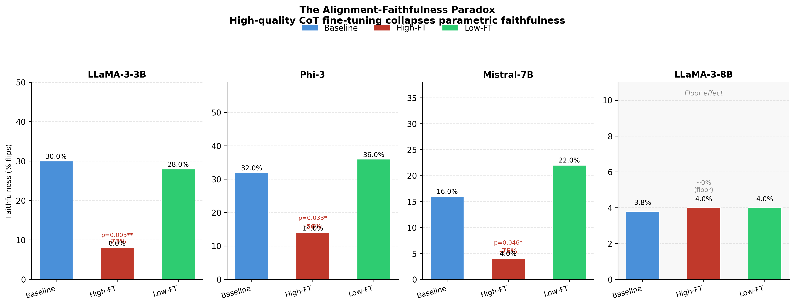

# Chain-of-Thought Faithfulness by Unlearning

This repository contains the code and results for reproducing and extending the experiments from:

> **Measuring Faithfulness of Chains of Thought by Unlearning Reasoning Steps**
> Tutek, M., Chaleshtori, F. H., Marasović, A., & Belinkov, Y. (2025)
> [[arXiv:2502.14829]](https://arxiv.org/abs/2502.14829)

> **Reproduction + Extensions** — includes new analyses and a new experiment not in the original paper. See [New Findings](#new-findings-extensions-beyond-the-paper) and [The Alignment-Faithfulness Paradox](#the-alignment-faithfulness-paradox-new-experiment).



---

## The Alignment-Faithfulness Paradox (New Experiment)

> **Does fine-tuning on high-quality CoT outputs increase or decrease parametric faithfulness?**

We ran a controlled experiment: fine-tune each model on high-quality vs. low-quality CoT data (LoRA, rank 16, 400–500 instances), then measure parametric faithfulness on a 50-instance held-out test set using the same NPO unlearning probe. Results:

| Model | Baseline | High-FT | Low-FT | Relative Drop |
|-------|:--------:|:-------:|:------:|:-------------:|
| LLaMA-3-3B | 30.0% | **8.0%** | 28.0% | −73%  |
| Phi-3       | 32.0% | **14.0%** | 36.0% | −56% |
| Mistral-7B  | 16.0% | **4.0%** | 22.0% | −75%  |
| LLaMA-3-8B  | 3.8%  | 4.0%   | 4.0%  | ~0% (null)    |

**p-values (two-proportion z-test, high-FT vs. baseline):**
LLaMA-3-3B p=0.005, Phi-3 p=0.033, Mistral-7B p=0.046, LLaMA-3-8B p=0.95 (n.s.)

**Key finding:** High-quality CoT fine-tuning consistently *reduces* parametric faithfulness by 56–75% across three model families. Low-quality fine-tuning leaves faithfulness unchanged. LLaMA-3-8B shows a floor effect (near-zero baseline faithfulness), consistent with larger models having weaker CoT-parameter coupling.

**Mechanism:** Non-faithful CoT steps score significantly higher on quality metrics than faithful ones (3.61 vs. 3.33, p=0.008, N=940), meaning quality filtering preferentially selects causally-decoupled reasoning.

Pipeline files:
- `score_cot_quality.py` — GPT-4o quality scoring of CoT steps
- `make_finetune_splits.py` — create high/low quality training splits
- `finetune_lora.py` — LoRA fine-tuning
- `evaluate_finetuned.py` — NPO faithfulness evaluation on fine-tuned models
- `merge_adapters_nopeft.py` — pre-merge LoRA adapters to avoid PEFT/Triton issues on HPC
- `finetune_data/` — training splits (high/low quality) and held-out test set
- `finetuned_results/` — evaluation results for all 6 conditions across 4 models

---

## Core Idea

A model's Chain-of-Thought (CoT) is **faithful** if the reasoning steps actually drive the final answer. This is measured by applying **Negative Preference Optimization (NPO)** to *unlearn* individual CoT sentences, then checking whether the model's answer changes. If unlearning a step causes the answer to change, that step was genuinely influencing the output.

---

## Models & Datasets

**Models evaluated:**
| Short name | HuggingFace ID |
|---|---|
| LLaMA-3-3B | `meta-llama/Llama-3.2-3B-Instruct` |
| LLaMA-3-8B | `meta-llama/Meta-Llama-3-8B-Instruct` |
| Mistral-7B | `mistralai/Mistral-7B-Instruct-v0.2` |
| Phi-3 | `microsoft/Phi-3-mini-4k-instruct` |

**Datasets:**
- `arc-challenge` — ARC Challenge
- `openbook` — OpenBookQA
- `sports` — Sports Understanding (BIG-Bench)
- `sqa` — StrategyQA (requires `data/strategyqa/strategyqa_train.json`)

---

## Setup

```bash
pip install -r requirements.txt
python -m spacy download en_core_web_sm
```

Set your HuggingFace token in `unlearn.py` (line ~370):
```python
login("hf_YOUR_TOKEN_HERE")
```

StrategyQA data:
```bash
mkdir -p data/strategyqa
wget -O data/strategyqa/strategyqa_train.json \
  https://raw.githubusercontent.com/wicsaax/strategy-qa/main/strategyQA_train.json
```

---

## Compute

All 16 base experiments (4 models × 4 datasets) and all alignment-faithfulness paradox conditions were trained on **BigRed 200**, Indiana University's high-performance computing cluster. Each job ran on an NVIDIA A100 GPU (40GB VRAM) via SLURM — small models (Phi-3, LLaMA-3-3B) on a single GPU with 32GB RAM, and large models (LLaMA-3-8B, Mistral-7B) on 2 GPUs with 64GB RAM.

---

## Running Experiments

**Single run:**
```bash
python unlearn.py \
  --model_name meta-llama/Llama-3.2-3B-Instruct \
  --strategy sentencize \
  --stepwise \
  --dataset sqa \
  --lr 3e-05 \
  --pos \
  --ff2 \
  --method npo_KL
```

**Key flags:**
| Flag | Description |
|---|---|
| `--model_name` | HuggingFace model ID |
| `--dataset` | `arc-challenge`, `openbook`, `sports`, `sqa` |
| `--method` | `npo_KL` (default), `npo`, `npo_grad_diff` |
| `--ff2` | Restrict optimization to FF2 layers (`mlp.down_proj.weight`) |
| `--pos` | Filter function tokens via spaCy POS tagging |
| `--stepwise` | Unlearn one CoT sentence at a time |
| `--strategy sentencize` | Split CoT into sentences using NLTK |
| `--new_cot` | Force regeneration of CoTs (otherwise cached in `final_cot/`) |

**Generate all 16 SLURM job scripts (BigRed200 / any SLURM cluster):**
```bash
python run_scripts.py
```
Uses `ul_step_pos_ff2.job` (32G, 12h) for small models and `ul_step_pos_ff2_L2.job` (64G, 24h) for LLaMA-3-8B and Mistral-7B.

---

## Experiment Pipeline

1. **CoT generation** (`data.py:load_or_generate_dataset_cots`) — generates or loads cached CoTs from `final_cot/{dataset}/{model}_s={seed}_t={temp}_cots.jsonl`
2. **Per-instance unlearning** (`unlearn.py:unlearn_single`) — for each instance and each CoT step, loads two model copies (trainable + frozen oracle) and applies NPO loss
3. **Evaluation after each epoch** (`unlearn.py:evaluate`) — measures CoT probability, answer probabilities (efficacy + specificity), and generates a new CoT
4. **Results** saved as JSONL to `final_results/{dataset}/{short_model}/`

### Loss Functions

- `npo` — forget loss only (NPO against frozen oracle)
- `npo_grad_diff` — forget loss + cross-entropy retain loss
- `npo_KL` — forget loss + KL divergence retain loss *(used in paper)*

---

## Results

### Base Reproduction (16 model × dataset combinations)

All 16 experiments completed. Settings: `npo_KL`, `--stepwise`, `--ff2`, `--pos`, `lr=3e-05`, `rs=1001`.

**Faithfulness (%) — % of instances where unlearning a CoT step caused a prediction flip:**

| Model | ARC-Challenge | OpenBookQA | Sports | StrategyQA | Avg |
|---|:---:|:---:|:---:|:---:|:---:|
| LLaMA-3-8B | 62.50 | 56.92 | 61.82 | 59.56 | **60.2** |
| LLaMA-3-3B | 36.00 | 51.50 | 34.30 | 50.28 | **43.0** |
| Mistral-7B  | 78.39 | 75.27 | 63.49 | 70.68 | **72.0** |
| Phi-3       |  4.31 |  5.42 | 25.00 |  6.52 | **10.3** |

**Efficacy–Faithfulness correlation: Pearson r = 0.937 (p < 0.0001)** — replicating the paper's central finding.

> **Note on LR:** All 16 experiments used `lr=3e-05`. The original paper calibrates per-model LRs (e.g. Phi-3 uses `1e-04`, Mistral uses `5e-06`). See [`REPRODUCTION_REPORT.md`](REPRODUCTION_REPORT.md) for details.

---

## New Findings (extensions beyond the paper)

### Finding 1 — Binary faithfulness systematically undercounts causal signal

We introduce **delta_p** — the change in correct-answer probability after unlearning — as a continuous faithfulness score. Binary faithfulness misses 52.2% of causally influential steps in LLaMA-3-3B (instances with delta_p > 0 but no prediction flip, termed *subcritical faithfulness*).

### Finding 2 — Counterproductive CoT in Phi-3

In 67.8% of Phi-3 instances, unlearning a CoT step *increases* correct-answer probability — meaning the CoT was actively suppressing the correct answer. This failure mode is invisible to binary faithfulness.

### Finding 3 — LR sensitivity manifests within a single run

For Mistral-7B at lr=3e-05 (~6× its paper-optimal lr), faithfulness peaks at epoch 2 then degrades as specificity collapses. Monitoring per-epoch specificity (stop when below ~70%) can substitute for a full LR sweep.

### Finding 4 — CoT structural density moderates faithfulness

Mean delta_p drops from 0.271 (1–2 sentence CoTs) to 0.077 (8+ sentences). LLaMA-3-8B generates shorter CoTs on average, partially explaining its higher faithfulness vs. LLaMA-3-3B.

---

## Bugs Found in Reproduction

| File | Bug | Fix |
|---|---|---|
| `unlearn.py` | `args.atomic` referenced but `--atomic` never registered — crashes on startup | Added `parser.add_argument('--atomic', ...)` |
| `unlearn.py` | `trust_remote_code=True` hardcoded, contradicting `models.py` | Changed to `False` |
| `run_scripts.py` | `lrs` dead code implying an LR sweep was run | Replaced with comment |
| `util.py` / `const.py` | `s=True` in filename pattern + paper's per-model LRs → silent empty results | Fixed `s=False`; overrode all LRs to `3e-05` |

---

## Code Structure

| File | Description |
|---|---|
| `unlearn.py` | Main entry point — NPO training loop, evaluation |
| `models.py` | Model loading, Phi-3 compatibility patch |
| `data.py` | CoT caching, `SegmentOTFDataset`, `FRCollator` |
| `dataload.py` | Dataset handlers for ARC, OpenBookQA, Sports, SQA |
| `evaluate.py` | CoT generation, completion/answer probabilities |
| `segment.py` | POS-tag based token filtering via spaCy |
| `const.py` | Model name → path mappings |
| `run_scripts.py` | Generates SLURM `sbatch` commands |
| `score_cot_quality.py` | GPT-4o scoring of CoT step quality |
| `make_finetune_splits.py` | Build high/low quality training splits |
| `finetune_lora.py` | LoRA fine-tuning pipeline |
| `evaluate_finetuned.py` | NPO faithfulness eval on fine-tuned models (subprocess-per-instance) |
| `merge_adapters_nopeft.py` | Manual LoRA merge (no PEFT/bitsandbytes/Triton) |
| `extended_analyses.py` / `new_analyses.py` | Extended analyses: delta_p, subcritical faithfulness, quartile plots |

**Notebooks:**
- `Ablations.ipynb` — paper plots and tables
- `Generate_CoT_heatmaps.ipynb` — CoT heatmap figures
- `Annotation analysis.ipynb` — human annotation study analysis
- `CoT LLM as judge.ipynb` — GPT-4o judge of post-unlearning CoT changes

---

## Citation

```bibtex
@article{tutek2025measuring,
  title={Measuring Faithfulness of Chains of Thought by Unlearning Reasoning Steps},
  author={Tutek, Martin and Chaleshtori, Farzad Habibi and Marasovi{\'c}, Ana and Belinkov, Yonatan},
  journal={arXiv preprint arXiv:2502.14829},
  year={2025}
}
```
