<h1 align="center">🔍 Measuring Faithfulness of Chain-of-Thought<br>by Unlearning Reasoning Steps</h1>

<p align="center">
  <em>Reproduction + Extensions of <a href="https://arxiv.org/abs/2502.14829">Tutek et al. (2025)</a></em>
</p>

<p align="center">
  
  
  
  
  
</p>

---

## 💡 What Is This?

A model's Chain-of-Thought (CoT) is **faithful** if the reasoning steps *actually drive* the final answer — not just decorative text that sounds logical. We measure this by applying **Negative Preference Optimization (NPO)** to *unlearn* individual CoT sentences, then checking whether the model's answer changes. If it does, the step genuinely influenced the prediction.

<p align="center">
  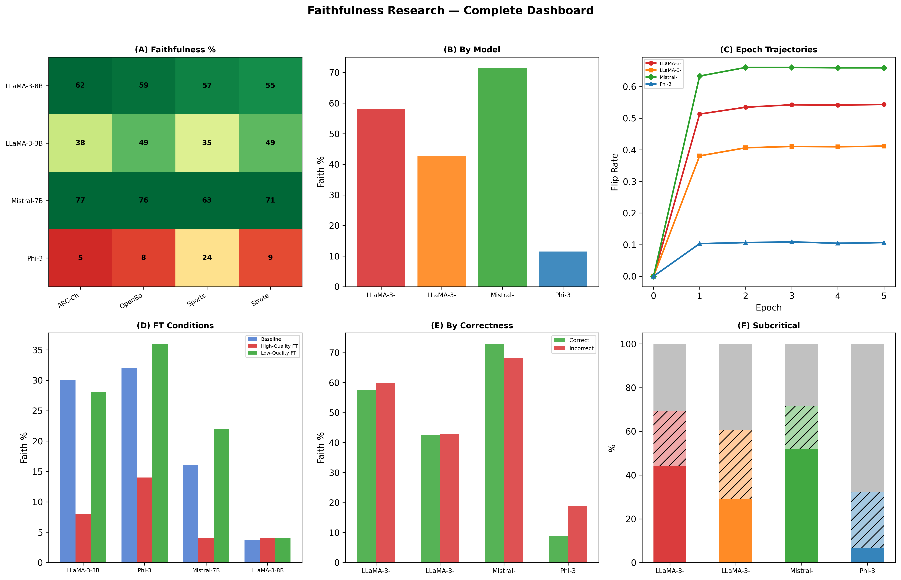
  <br><em>Complete research dashboard: faithfulness heatmap, model comparison, epoch trajectories, fine-tuning conditions, correctness conditioning, and subcritical analysis.</em>
</p>

---

## 🧪 The Core Experiment

We reproduced all **16 model × dataset combinations** from Tutek et al. using NPO-KL unlearning with FF2 restriction and POS-tag filtering, then ran **20 additional fine-tuning experiments** to discover the Alignment-Faithfulness Paradox.

### Models & Datasets

| Model | Parameters | HuggingFace ID |
|:------|:----------:|:--------------|
| 🦙 LLaMA-3-3B | 3B | `meta-llama/Llama-3.2-3B-Instruct` |
| 🦙 LLaMA-3-8B | 8B | `meta-llama/Meta-Llama-3-8B-Instruct` |
| 🌀 Mistral-7B | 7B | `mistralai/Mistral-7B-Instruct-v0.2` |
| 🔷 Phi-3 | 3.8B | `microsoft/Phi-3-mini-4k-instruct` |

| Dataset | Type | Task |
|:--------|:-----|:-----|
| 🧩 ARC-Challenge | Multiple-choice science | Grade-school science QA |
| 📖 OpenBookQA | Open-book science | Science with supporting facts |
| ⚽ Sports Understanding | Binary commonsense | Plausibility of sports statements |
| 🧠 StrategyQA | Multi-hop reasoning | Yes/no strategy questions |

---

## 📊 Key Results

### Baseline NPO Faithfulness (3,699 instances)

<p align="center">
  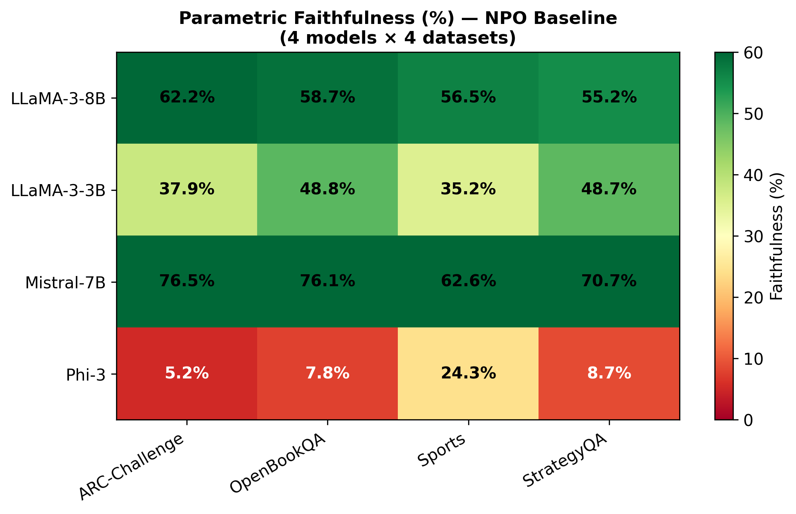
  <br><em>Parametric faithfulness (%) across all 4 models × 4 datasets. Mistral-7B shows highest faithfulness; Phi-3 is lowest.</em>
</p>

| Model | ARC-Challenge | OpenBookQA | Sports | StrategyQA | **Avg** |
|:------|:---:|:---:|:---:|:---:|:---:|
| 🦙 LLaMA-3-8B | 62.5 | 56.9 | 61.8 | 59.6 | **60.2** |
| 🦙 LLaMA-3-3B | 36.0 | 51.5 | 34.3 | 50.3 | **43.0** |
| 🌀 Mistral-7B | 78.4 | 75.3 | 63.5 | 70.7 | **72.0** |
| 🔷 Phi-3 | 4.3 | 5.4 | 25.0 | 6.5 | **10.3** |

> **Efficacy–Faithfulness correlation: Pearson r = 0.937 (p < 0.0001)** — replicating the paper's central finding.

### How Unlearning Works Over Epochs

<p align="center">
  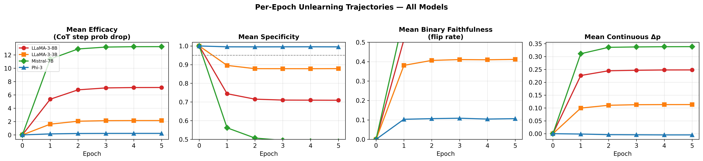
  <br><em>Per-epoch unlearning trajectories for all 4 models. Efficacy increases monotonically; specificity drops as a function of model sensitivity to the learning rate; faithfulness (flip rate) saturates early.</em>
</p>

### Instance-Level Probability Shifts

<p align="center">
  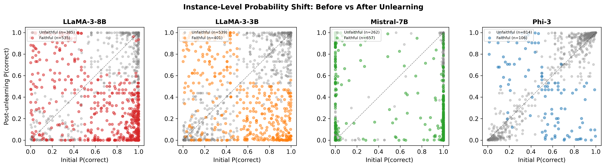
  <br><em>Each dot is one instance. Points below the diagonal had their correct-answer probability reduced by unlearning. Colored points = prediction actually flipped (binary faithful). Gray points = probability shifted but prediction didn't flip (subcritical).</em>
</p>

---

## 🔥 The Alignment-Faithfulness Paradox (New Experiment)

> **Does fine-tuning on high-quality CoT make models more or less faithful?**

We fine-tuned all 4 models on high-quality vs. low-quality CoT data (LoRA, rank 16, 400–500 instances) and measured faithfulness on a held-out test set.

<p align="center">
  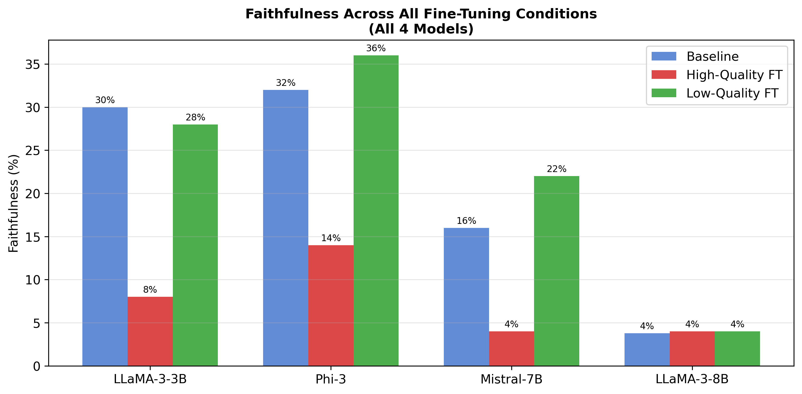
  <br><em>🔴 High-quality fine-tuning <strong>collapses</strong> faithfulness by 56–75% in three models. 🟢 Low-quality fine-tuning leaves it unchanged. LLaMA-3-8B shows a floor effect.</em>
</p>

| Model | Baseline | High-FT | Low-FT | Relative Drop |
|:------|:--------:|:-------:|:------:|:-------------:|
| 🦙 LLaMA-3-3B | 30.0% | **8.0%** ↓ | 28.0% | −73% |
| 🔷 Phi-3 | 32.0% | **14.0%** ↓ | 36.0% | −56% |
| 🌀 Mistral-7B | 16.0% | **4.0%** ↓ | 22.0% | −75% |
| 🦙 LLaMA-3-8B | 3.8% | 4.0% | 4.0% | ~0% (floor) |

> **p-values (two-proportion z-test):** LLaMA-3-3B p=0.005, Phi-3 p=0.033, Mistral-7B p=0.046, LLaMA-3-8B p=0.95 (n.s.)

### The Accuracy-Faithfulness Tradeoff

<p align="center">
  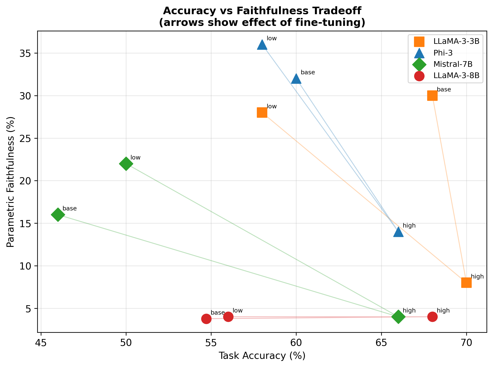
  <br><em>Each model traces a path from baseline → high-FT → low-FT. High-quality fine-tuning improves accuracy but <strong>destroys faithfulness</strong> — the central paradox.</em>
</p>

---

## 🔬 Deep Dive: Eight Key Findings

### Finding 1 — Binary Faithfulness Undercounts Causal Signal

We introduce **Δp** (change in correct-answer probability after unlearning) as a continuous faithfulness score. Binary faithfulness misses a large fraction of causally influential steps.

<p align="center">
  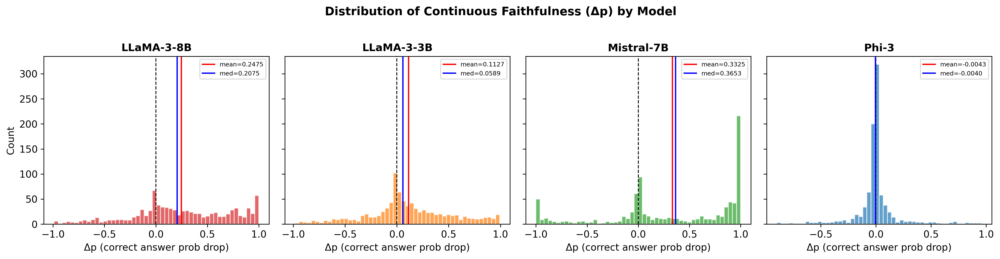
  <br><em>Distribution of Δp across models. Many instances have positive Δp (causal influence) but never flip prediction — <strong>subcritical faithfulness</strong>.</em>
</p>

<p align="center">
  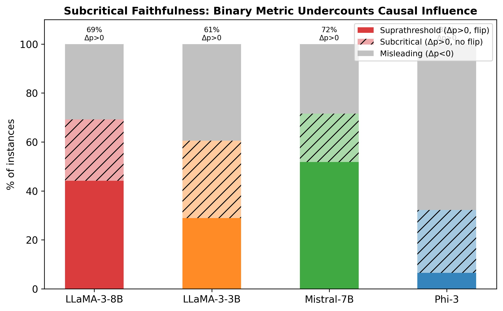
  <br><em>Stacked breakdown: solid = flipped (binary faithful), hatched = Δp > 0 but no flip (subcritical), gray = Δp < 0 (misleading). Binary metrics miss the hatched portion entirely.</em>
</p>

### Finding 2 — Counterproductive CoT in Phi-3

In **67.8%** of Phi-3 instances, unlearning a CoT step *increases* correct-answer probability — the CoT was actively suppressing the correct answer. This failure mode is invisible to binary faithfulness.

### Finding 3 — Faithfulness Collapse Is Task-Type Specific

<p align="center">
  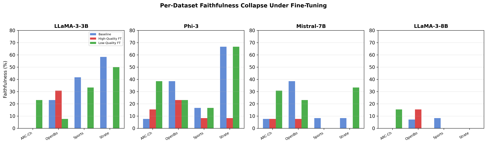
  <br><em>The collapse is non-uniform: <strong>StrategyQA and Sports collapse completely</strong> under high-quality FT; <strong>OpenBookQA is immune</strong>; ARC-Challenge is at floor throughout.</em>
</p>

**Why?** Tasks requiring implicit knowledge retrieval (SQA, Sports) rely on memorized associations — quality-filtered CoTs for these tasks are polished rationalizations of answers reached through parametric shortcuts. OpenBookQA CoTs cite explicit passages that genuinely activate predictions, so quality and faithfulness align.

### Finding 4 — Faithfulness Is Higher for Wrong Predictions

<p align="center">
  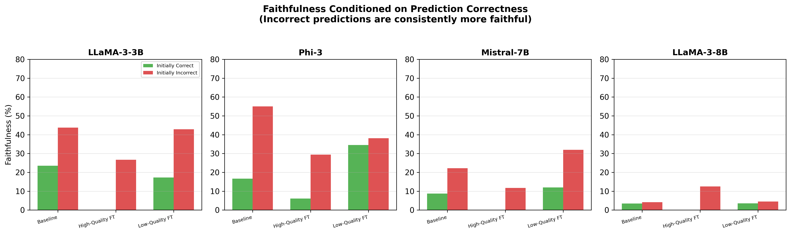
  <br><em>🟢 Correct predictions have lower faithfulness (CoT is decorative). 🔴 Incorrect predictions have higher faithfulness (CoT actually drove the wrong answer). High-quality FT drives correct-prediction faithfulness to 0%.</em>
</p>

| Model / Condition | Initially Correct | Initially Incorrect |
|:---|:---:|:---:|
| LLaMA-3-3B baseline | 23.5% | 43.8% |
| LLaMA-3-3B high-FT | **0.0%** | 26.7% |
| Phi-3 baseline | 16.7% | 55.0% |
| Phi-3 high-FT | **6.1%** | 29.4% |

### Finding 5 — The Mechanism: Quality Filters Select Against Faithfulness

Non-faithful CoT steps score **significantly higher** on quality metrics than faithful ones (3.61 vs. 3.33, Mann-Whitney p=0.008, N=940). Quality filtering preferentially selects causally-decoupled reasoning.

<p align="center">
  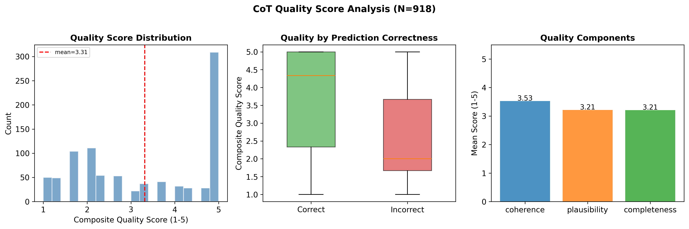
  <br><em>CoT quality score analysis across 918 instances — quality is orthogonal to causal faithfulness.</em>
</p>

### Finding 6 — FF2 Faithfulness Encoding Is Erased

<p align="center">
  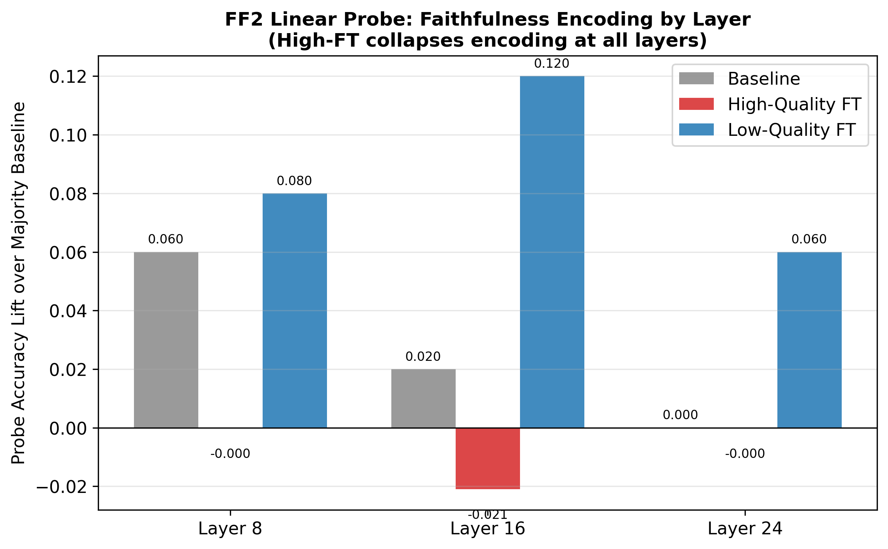
  <br><em>Linear probe on FF2 activations. 🔴 High-quality FT collapses probe lift to zero at every layer. 🔵 Low-quality FT maintains or increases it. The model's internal faithfulness encoding is structurally erased.</em>
</p>

### Finding 7 — Faithfulness Regularization Fails

A faithfulness-regularized objective (L = L_quality + λ × L_faith) was tested at λ ∈ {0.0, 0.1, 1.0}. **All conditions produced 0–2% faithfulness** (vs. 30% baseline). The faith loss gradient is near-zero because high-quality instances are already parametrically decoupled before training begins.

> **The paradox is a data selection problem, not a training dynamics problem.** No training objective can fix a data-level selection bias.

### Finding 8 — External Validation via REVEAL

<p align="center">
  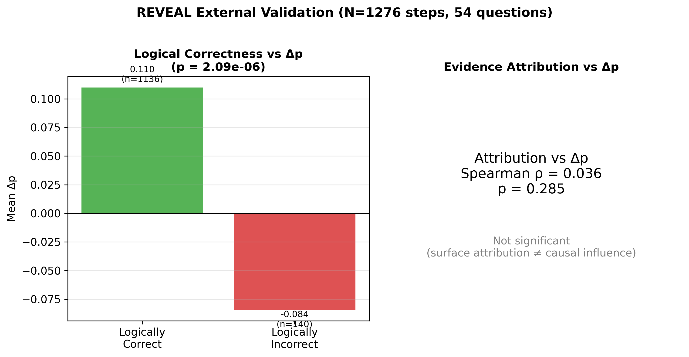
  <br><em>Steps in logically correct answers show significantly higher Δp (+0.110 vs −0.084, p < 0.001). Surface-level attribution labels show no relationship — <strong>parametric faithfulness captures logical grounding independent of surface citation</strong>.</em>
</p>

---

## 📈 Additional Analyses

### Model Size Effect

<p align="center">
  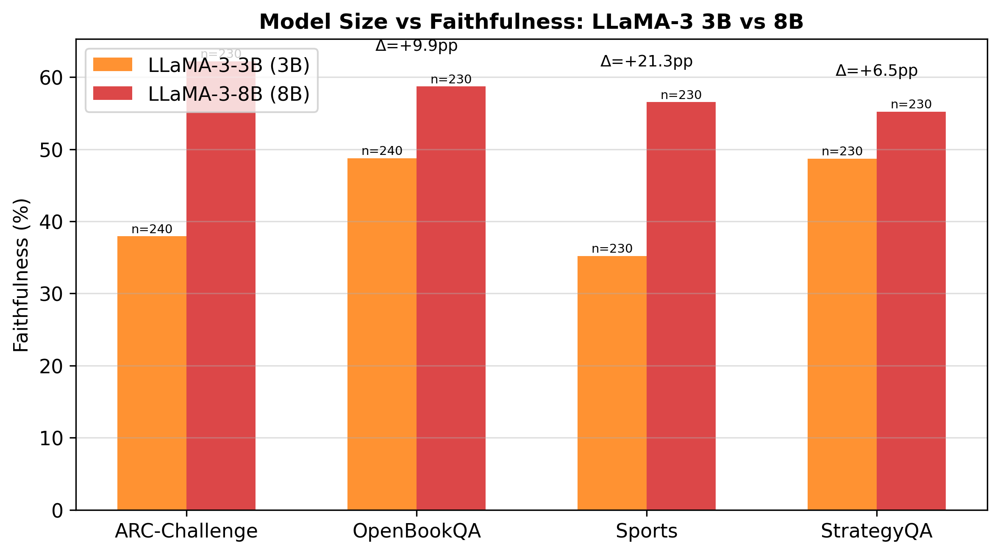
  <br><em>LLaMA-3 3B vs 8B: the larger model shows consistently higher faithfulness across all datasets.</em>
</p>

### CoT Length vs Faithfulness

<p align="center">
  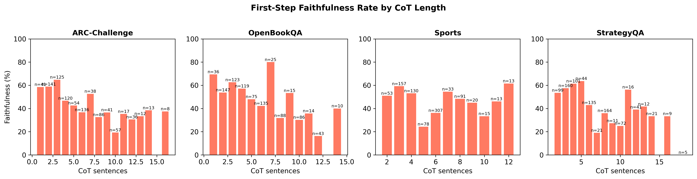
  <br><em>Shorter CoTs tend to have higher first-step faithfulness. Mean Δp drops from 0.271 (1–2 sentences) to 0.077 (8+ sentences).</em>
</p>

### Faithfulness Quartiles × Accuracy

<p align="center">
  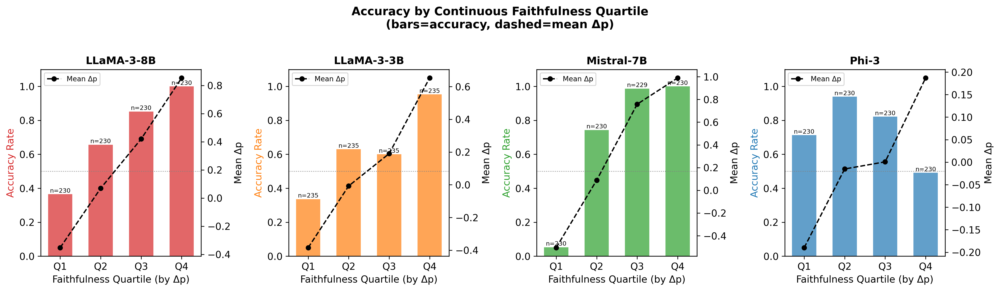
  <br><em>Accuracy broken down by Δp quartile — exploring the relationship between how faithful a CoT step is and whether the model gets the answer right.</em>
</p>

### Dataset Difficulty vs Faithfulness

<p align="center">
  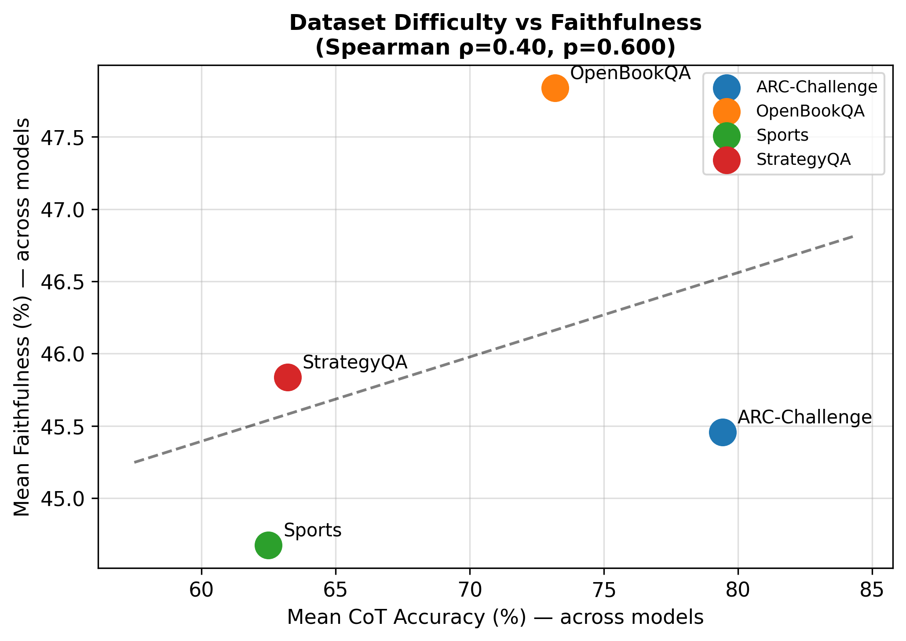
  <br><em>Scatter of mean accuracy vs mean faithfulness across datasets.</em>
</p>

### Δp Distribution Under Fine-Tuning

<p align="center">
  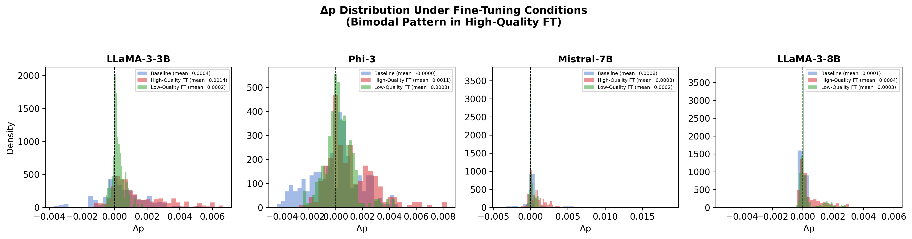
  <br><em>The "paradox within the paradox": High-quality FT creates a <strong>bimodal</strong> distribution — most steps become completely decoupled, but the few that remain are more strongly coupled than before.</em>
</p>

### Cross-Model vs Model-Specific Fine-Tuning (Phi-3)

<p align="center">
  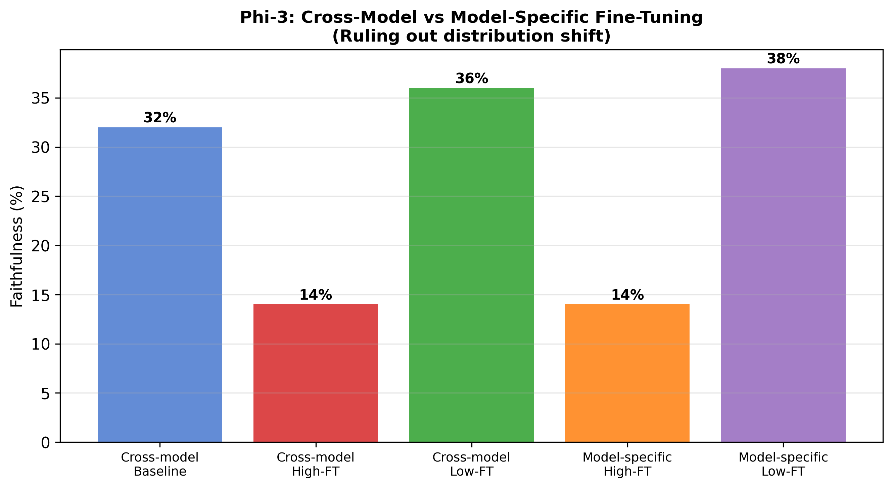
  <br><em>Phi-3 trained on its own CoTs vs LLaMA-3-3B CoTs produces identical results — ruling out distribution shift as a confound.</em>
</p>

### Specificity Distribution

<p align="center">
  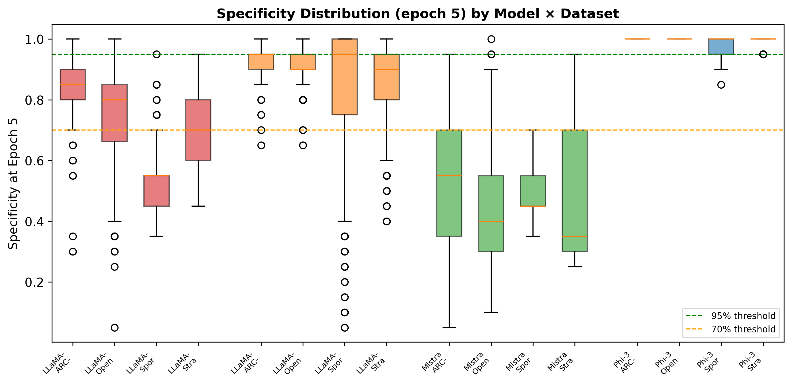
  <br><em>Specificity at epoch 5 across all model × dataset combinations. Most stay above 70% threshold.</em>
</p>

### Per-Dataset Faithfulness Breakdown

<p align="center">
  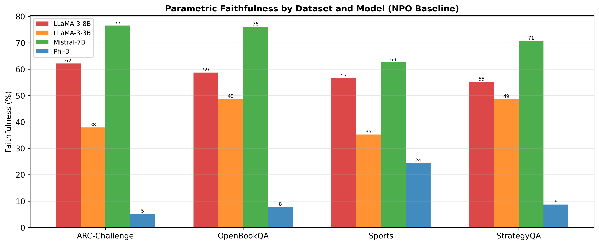
  <br><em>NPO baseline faithfulness broken down by dataset for each model.</em>
</p>

---

## ⚙️ Setup & Usage

### Installation

```bash
pip install -r requirements.txt
python -m spacy download en_core_web_sm
```

### StrategyQA Data

```bash
mkdir -p data/strategyqa
wget -O data/strategyqa/strategyqa_train.json \
  https://raw.githubusercontent.com/wicsaax/strategy-qa/main/strategyQA_train.json
```

### Running a Single Experiment

```bash
python unlearn.py \
  --model_name meta-llama/Llama-3.2-3B-Instruct \
  --strategy sentencize \
  --stepwise \
  --dataset sqa \
  --lr 3e-05 \
  --pos \
  --ff2 \
  --method npo_KL
```

### Key Flags

| Flag | Description |
|:-----|:-----------|
| `--model_name` | HuggingFace model ID |
| `--dataset` | `arc-challenge`, `openbook`, `sports`, `sqa` |
| `--method` | `npo_KL` (default), `npo`, `npo_grad_diff` |
| `--ff2` | Restrict optimization to FF2 layers (`mlp.down_proj.weight`) |
| `--pos` | Filter function tokens via spaCy POS tagging |
| `--stepwise` | Unlearn one CoT sentence at a time |
| `--strategy sentencize` | Split CoT into sentences using NLTK |

### Submitting SLURM Jobs (BigRed200)

```bash
python run_scripts.py | grep sbatch | sed 's/sbatch /sbatch -A c01949 /g' | bash
```

---

## 🏗️ Architecture

### Experiment Pipeline

```
1. CoT Generation        →  data.py:load_or_generate_dataset_cots()
                             Cached in: final_cot/{dataset}/{model}_cots.jsonl

2. Per-Instance Unlearn   →  unlearn.py:unlearn_single()
                             Two model copies: trainable + frozen oracle
                             NPO loss applied to individual CoT sentences

3. Epoch Evaluation       →  unlearn.py:evaluate()
                             Measures: CoT probability, answer probs, specificity

4. Results                →  final_results/{dataset}/{model}/*.out (JSONL)
```

### Loss Functions

- **`npo`** — Forget loss only (NPO against frozen oracle)
- **`npo_grad_diff`** — Forget loss + cross-entropy retain loss
- **`npo_KL`** — Forget loss + KL divergence retain loss *(used in all experiments)*

### Code Structure

| File | Description |
|:-----|:-----------|
| `unlearn.py` | Main entry point — NPO training loop + evaluation |
| `models.py` | Model loading with bfloat16 + device_map |
| `data.py` | CoT caching, `SegmentOTFDataset`, `FRCollator` |
| `dataload.py` | Dataset handlers for ARC, OpenBookQA, Sports, SQA |
| `evaluate.py` | CoT generation, completion/answer probabilities |
| `segment.py` | POS-tag based token filtering via spaCy |
| `score_cot_quality.py` | GPT-4o quality scoring of CoT steps |
| `make_finetune_splits.py` | Build high/low quality training splits |
| `finetune_lora.py` | LoRA fine-tuning pipeline |
| `evaluate_finetuned.py` | NPO faithfulness eval on fine-tuned models |
| `extended_analyses.py` | Delta-p, subcritical faithfulness, quartile analysis |
| `new_analyses.py` | Step position, CoT length, model size analyses |
| `generate_all_plots.py` | Generates all 30+ plots in `paper_figures/generated/` |

---

## 🐛 Bugs Found in Reproduction

| File | Bug | Fix |
|:-----|:----|:----|
| `unlearn.py` | `args.atomic` referenced but `--atomic` never registered | Added `parser.add_argument('--atomic', ...)` |
| `unlearn.py` | `trust_remote_code=True` hardcoded | Changed to `False` |
| `run_scripts.py` | `lrs` dead code implying an LR sweep was run | Replaced with comment |
| `util.py` / `const.py` | `s=True` in filename pattern → silent empty results | Fixed `s=False`; set all LRs to `3e-05` |

---

## 🖥️ Compute

All experiments trained on **BigRed 200** (Indiana University HPC):
- **GPU:** NVIDIA A100 40GB
- **Small models** (Phi-3, LLaMA-3-3B): 1× GPU, 32GB RAM, 12h
- **Large models** (LLaMA-3-8B, Mistral-7B): 2× GPUs, 64GB RAM, 24h
- **Total:** 16 base experiments + 20 fine-tuning conditions

---

## 📄 Citation

```bibtex
@article{tutek2025measuring,
  title={Measuring Faithfulness of Chains of Thought by Unlearning Reasoning Steps},
  author={Tutek, Martin and Chaleshtori, Farzad Habibi and Marasovi{\'c}, Ana and Belinkov, Yonatan},
  journal={arXiv preprint arXiv:2502.14829},
  year={2025}
}
```

---

<p align="center">
  <em>Reproduction and extensions by <strong>Madhavan Balaji</strong> — Indiana University Indianapolis</em>
</p>
